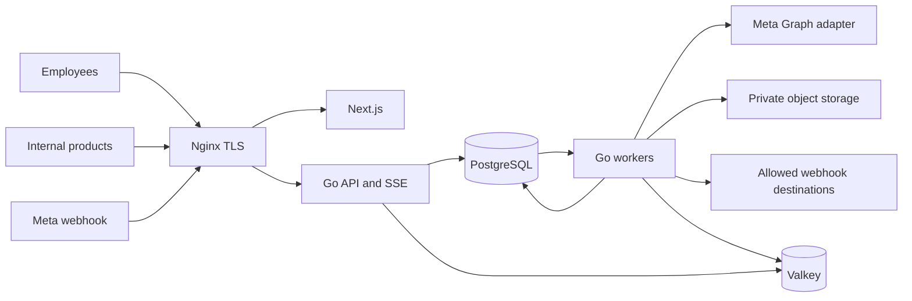

# System architecture

Use a Go modular monolith with two execution modes: API and worker. Deploy the Next.js frontend separately behind the same origin. PostgreSQL owns durable domain state, jobs and an outbox. Valkey owns disposable presence, caching and coordination hints; it is not the authority for money, consent, idempotency or job recovery. [ADRs](../ADR/README.md) record alternatives.

Nginx routes `/api/`, `/events/` and `/webhooks/` directly to Go. Next.js handles navigation/rendering and assets, not a second business API. Server components may call Go using request-scoped identity; never cache tenant data in a shared process/global cache. Browser authentication uses same-origin secure cookies. API keys are for machine consumers.

## Module boundaries

| Module | Owns | Dependencies and boundary |
| --- | --- | --- |
| identity | Users, credentials, sessions, invitations, transactional mail delivery | Provider-neutral mail boundary; SMTP initially for verification/reset/invites/security notices; no marketing email or Meta tokens |
| access | Organizations, members, teams, roles, scoped grants | Provides explicit access evaluation and delegation rules |
| meta | Apps, encrypted credential references, WABAs, phones, observed capabilities, sync | Sole Graph translation/error boundary; never decides campaign eligibility |
| customer | Contacts, identifiers, tags, fields, consent, suppression, import provenance | Exposes current eligibility under transaction locks |
| inbox | Conversations, assignment, notes, read markers, service windows, handoff | Uses messaging for sends; owns human/bot arbitration |
| messaging | Immutable intents, attempts, message facts, media references | Orchestrates the common send gate and adapter dispatch |
| content | Templates/versions/status; Flows/versions/instances/responses | Observed Meta state separated from local drafts |
| outreach | Audiences, snapshots, campaign versions/runs/recipients | Schedules intents; cannot call Graph directly |
| controls | Pricing policies/estimates, confirmations, budgets, approvals, frequency | Transactional guard decisions; no independent sending |
| automation | Rules, versions, bounded runs and effects | Sends through messaging; shares human-handoff revisions |
| delivery | Raw webhook ingestion, durable jobs, outbox, outgoing subscriptions | Routes normalized events; does not expose raw payloads to all consumers |
| reporting | Derived metrics, targeted notifications, health projections | Reads source-labeled facts; cannot manufacture billing certainty |
| audit | Append-only redacted action history | Written in the domain transaction for critical changes |

Modules use concrete Go services and explicit SQL via pgx/sqlc if validated in Sprint 0. Introduce interfaces at external effects, clock, object storage and transaction test seams, not for every table. No generic repository or service locator. Domain operations accept a typed organization/principal context and a transaction when atomic coordination is necessary. Cross-module writes occur through explicit functions, not ad hoc SQL from handlers.

## Send and event boundaries

Every agent, campaign, API consumer and automation requests a `send_intent`. A common gate checks permission, current sender binding, consent/suppression, window, template/version, handoff, price, frequency, approvals and budgets. Passing preflight creates no external effect. Final transactional dispatch authorization consumes any confirmation and reserves all relevant budgets. Only the messaging dispatcher can use a messaging credential.

An external HTTP call cannot be atomic with PostgreSQL. Record DISPATCHING before calling Meta; after a crash or ambiguous timeout, mark UNCERTAIN and retain exposure. Never assert exactly-once delivery or assume a client idempotency key is honored by Meta. Worker leases prevent most concurrency but cannot retract an HTTP request already in flight. Detailed protocol is in docs 08, 10 and 12.

Domain transaction commits normalized state, audit and outbox together. A poller discovers jobs/outbox even if Valkey is lost. At-least-once local delivery plus unique effect keys makes projections repeatable. This is a transaction outbox, not an event-sourced domain: current tables remain authoritative and deletion/retention is supported.

## Frontend ownership

Next.js App Router + TypeScript; TanStack Query caches server state under keys starting with organization ID and authorization revision. Lightweight component state holds view controls; per-user/org/conversation drafts persist in tab-local sessionStorage under doc 09's lifecycle/security rules; never duplicate campaign/window state machines in a client store. Tailwind tokens implement the product system. Version selection is gated on official security releases: Sprint 0 pins Next.js 16.3.4, Go 1.27.1 and Node 24.21.0 LTS. pgx SQL is used directly; sqlc, Tailwind and TanStack Query wait for actual domain/UI work, without changing their planned roles. [Release evidence](21-research-register.md).

SSE carries authorized state invalidations/projections. REST carries all durable commands and throttled presence/typing heartbeats. Reconnect uses durable cursors and bounded replay; lost ephemeral typing is harmless. This avoids a separate bidirectional command protocol while meeting present needs. WebSocket is reconsidered only for a measured need such as future calling signaling.

## Scale and failure behavior

Start with one API and independently limited worker pools on one VPS. Isolate webhook ingestion/interactive work from bulk campaigns through separate queues, DB pools and concurrency budgets. Rate limiting is hierarchical: app/account/phone/recipient and internal safety policy. Exact Meta limits are configured only from verified account evidence.

Scale workers/API horizontally after profiling. Object storage is external from day one. Move PostgreSQL to a larger/dedicated host before adding messaging infrastructure. Keep a single database writer for budget correctness. Add partitioning/search systems only after query evidence warrants them.

Database unavailable: fail ingress with retryable error, do not ACK data that was not persisted. Valkey unavailable: presence degrades; DB-backed jobs remain recoverable; dispatch pauses if a required throttle cannot be enforced conservatively in the DB. Object store unavailable: keep media jobs queued, display unavailable media, and block outgoing media pending durable scan/upload. Meta unavailable: pause affected senders, retain intents and recheck at recovery. A single VPS outage stops operation; offsite recovery is the initial availability strategy.

## Implemented foundation boundary

backend/cmd/api runs the HTTP process; cmd/migrate applies reviewed SQL separately; cmd/smtpcheck performs TLS/authentication/NOOP only. Concrete packages are config, database, httpapi, migrate and smtpprobe. No worker mode or domain modules are created yet. frontend contains one engineering shell, safe read-only API boundary and error component; no product screens. [Actual evidence and pins](23-sprint-0-evidence.md).
