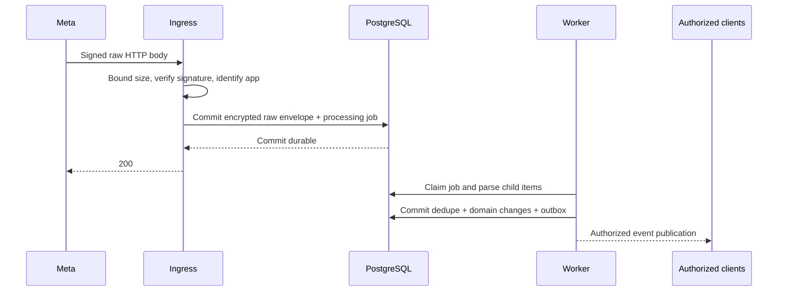

# Webhook ingestion and asynchronous work

## Ingress and durable acknowledgement

Use an opaque callback route bound to one internal app/organization, not a tenant ID supplied by Meta payload. The initial schema forbids a shared external app across internal organizations. Validate entry WABA and metadata phone against existing bindings. Unexpected assets enter restricted quarantine; discovery cannot silently authorize them.

Proposed verification contract: GET checks `hub.mode`, a constant-time comparison with stored verify-token digest, and returns `hub.challenge` only when valid. POST verifies `X-Hub-Signature-256` as HMAC-SHA256 over exact raw bytes using the app secret; constant-time compare; no decode/reencode before verification. **Current Meta signature/verification reference and rotation behavior NEEDS VERIFICATION (M26) before implementing this adapter.** Treat this as a security design candidate until a current official fixture confirms it; never implement a permissive fallback. Verify token is not the POST signing secret.

Bound HTTP body (provisional 4 MiB, adjust to verified Meta envelope limit), headers, decompression and request deadline before allocation. Reject invalid signatures; do not persist their bodies. Authenticated but unknown/malformed schema can be persisted to quarantine and ACKed, preventing retry storms, provided storage succeeds. DB failure/timeout returns retryable 5xx and never a success ACK. Duplicate raw body only ACKs after its original durable record is confirmed.

Store raw bytes encrypted, body digest, app/key version, receipt time and request correlation. No tokens/header dumps in logs. App subscription and WABA subscription are separate prerequisites. Existing callback consumers must be inventoried before configuration changes.

## Deduplication and ordering

Do not assume an HTTP-level universal Meta event ID. Traverse all entries, changes, messages and statuses; split children and independently route/validate. Envelope hash catches exact transport retries only. Message uniqueness is `(organization, phone, external_message_id)` across apps and repeated envelopes.

Semantic fact keys: inbound message = phone + message ID + receive effect; status = phone + message ID + status + provider timestamp + hash of relevant error/pricing facts; template/account event = asset + field + source timestamp/version + canonical value hash. Preserve changed facts as additional observations rather than discarding pricing updates because delivery status is unchanged. Unknown children use envelope-position hashes and trigger no automatic external effects.

Projection transaction inserts processed_event_key and updates domain state plus outbox. Unique conflict means that effect already committed. On transaction rollback the dedupe record also rolls back. Resource locks serialize conversation creation, sequence allocation and window updates. Status facts can precede HTTP response/inbound content; create/attach a minimal stub using external ID and later merge without replacing observed status.

Maintain sent/delivered/read timestamps independently; read arriving before sent is legitimate. Prefer evidence of forward delivery while retaining contradictions. Do not infer provider ordering from receipt time. Future-dated inbound timestamps beyond tolerance quarantine window activation; older messages update history but only a newer eligible inbound advances expiry. A raw-event replay cannot turn a historical message into a fresh service window.

## Retry, replay and send uncertainty

Local jobs are at-least-once. Claim small batches with PostgreSQL row locks, persist lease and fence, commit, then work. Heartbeats extend leases; stale local result commits are rejected. A poller recovers leases and unpublished outbox independently of Valkey.

Meta outbound send has no verified end-to-end idempotency guarantee in this design. Before network I/O, commit DISPATCHING and attempt/correlation. Proven pre-connect failure with zero possible request transmission can retry after revalidation. A definite rejected response retries only when the error registry proves non-acceptance and transient cause. Timeout, connection reset after write, unclassified 5xx or crash after dispatch means UNCERTAIN. Lease expiry after DISPATCHING also means UNCERTAIN. Do not resend merely because no webhook has arrived.

Persist any provider opaque callback/correlation field only after its current schema is verified; until then correlate through returned message IDs and observed facts. There is no assumed Meta message-history reconciliation API. Unknown outcomes remain visible, retain budget/frequency exposure and require evidence. An operator-authorized replacement is a new intent with duplicate-risk disclosure, renewed controls and an audit link; it cannot be disguised as a safe retry.

Replay defaults to PROJECT_ONLY with parser version and reason. Existing effect keys remain unchanged across parser versions. Historical events missing effect keys can repair projections but cannot send messages, call external URLs, issue fresh notifications or dispatch developer webhooks automatically. A separate reviewed LIVE_REDELIVERY command may reattempt an existing failed outbound delivery with its original event ID and current access checks. Erasure/suppression tombstones and retention apply before replay. A parser upgrade dry-run compares changes on redacted fixtures before production replay.

## Job contracts

Internal defaults, not Meta retry guarantees: backoff uses full jitter, base 2 s, cap 15 min, max 8 attempts unless specified; honor verified Retry-After. Transient DB/storage/network reads retry. Validation/permission/policy failures are terminal or blocked for an operator, not infinite retries. Every job logs org, job ID, kind, attempt, duration, fence, correlation and sanitized reason; metrics record lag and age without PII labels.

| Job | Trigger / idempotency key | Retry and terminal outcome / DLQ |
| --- | --- | --- |
| webhook.parse | Durable envelope / envelope ID + parser operation | 8 transient attempts; unknown schema retained UNKNOWN; poisoned known parser to DLQ with raw pointer |
| webhook.project | Parsed child / semantic key + effect kind | Transaction retry for contention; 8 operational attempts; DLQ isolated child, others continue |
| media.fetch.scan | Media message/upload / asset + source version | Immediate priority, refresh expired URL before retry; verified upstream expiry or 404 after bounded checks -> UNAVAILABLE; scan rejection terminal; operational failure DLQ |
| campaign.snapshot | Preflight / campaign revision | Repeatable snapshot staging, max 5 min provisional; failed build discarded logically and restarted; no partial seal; DLQ after 3 infrastructure failures |
| campaign.schedule | Due approved run / run + dispatch epoch | Poll DB due rows; guard failure PAUSED with reason; missed deadline EXPIRED authority, never silent next-day send |
| campaign.dispatch | Ready recipient / run + snapshot member | Common send protocol; known transient non-acceptance backoff; uncertain terminal review queue, not resend DLQ |
| messaging.dispatch | Agent/API/bot intent / intent ID | Same dispatch protocol; every retry rechecks all guards; policy block visible; poison operation to DLQ |
| outbox.publish | Domain commit / event ID + consumer | Retry until published; alert age; after 8 errors DLQ, sweeper makes missing publications visible |
| outbound_webhook.deliver | Event subscription / endpoint + event ID | 12 attempts over at most 24 h, jitter and cap; nonretryable 4xx terminal; 410 disables endpoint; exhausted to DLQ |
| contacts.import | Accepted preview / import ID + row number | Chunk transactions; retries resume rows; validation per-row error report; systemic failure after 3 attempts DLQ |
| contacts.export | Authorized request / export ID | Recheck requester/scope at execution; 3 retries; cancellation on lost permission; short-lived result; failure notification + DLQ |
| meta.sync | Schedule/manual/event / binding + resource kind + requested generation | Paginated checkpoint, rate-aware backoff; credentials denied -> connection degraded/blocked; after 8 transient errors DLQ |
| automation.execute | Normalized trigger / version + event ID | Per-action idempotency and expiry; loop/permission failure terminal; external uncertainty WAITING; failed operational job DLQ |
| analytics.aggregate | Period/event watermark / metric + dimensions + bucket + source watermark | Recompute idempotently, late facts reopen buckets; 8 retries then DLQ; display stale watermark |
| notifications.materialize | Domain event / member + event + type | Recheck access; coalesce; 8 retries then DLQ; no duplicate notification |
| conversation.wake | Snooze expiry / conversation + revision + wake time | Revision mismatch no-op; transient retry; DLQ with inbox-visible stale snooze |
| pricing.import.validate / pricing.import.diff | Explicit operator action / import + revision + source checksum + base | Retry local computation; revision-fenced report/state only; invalid evidence stays blocked; no automatic publication |
| pricing.review.remind | Due publication review/coverage end / publication + deadline | Scoped reminder only; never scrape or extend rates; overdue review blocks potentially paid dispatch |
| budget.reconcile | Billing evidence or periodic ledger scan / evidence + period | Unique ledger source, corrections append; mismatch alerts, never silently release; DLQ on invalid data |
| cleanup.retention | Daily due policy / resource + retention version | Hold/tombstone check; idempotent object+row purge checkpoint; errors retry then DLQ; retained content remains protected |
| backup.verify | Backup completion / backup manifest ID | Off-host controller; alert failure, do not mark successful without restore verification; infrastructure runbook rather than tenant worker credentials |

## Outbound webhooks and HTTP actions

Payload envelope is doc 07 plus permitted event-specific fields. Default excludes message text, notes, media URLs and Flow fields; opt-in scoped content requires explicit integration grant. Freeze payload bytes and hash at delivery creation. Before every attempt verify endpoint enabled, current subscription scope and privacy tombstones. If scope narrowed, cancel the old payload rather than silently changing bytes under the same event ID.

Sign `timestamp + "." + raw_body` using HMAC-SHA256 with per-endpoint recoverable encrypted secret. Headers: `WABA-Event-ID`, `WABA-Delivery-ID` (attempt ID), `WABA-Timestamp`, `WABA-Signature: v1=...`, `WABA-Signing-Key-ID`. Rotate keys with explicit overlap and consumer acknowledgement. Signature timestamp is fresh for each attempt; event ID/content remain unchanged. Consumer checks timestamp tolerance (proposed 5 min), constant-time signature and durable event-ID dedupe before effects. Delivery is at-least-once; no ordering guarantee.

HTTPS only, destination allowlist, DNS/IP validation at connection time, no redirects, block private/link-local/loopback/metadata endpoints unless a separately approved internal destination is deliberately configured. Prevent DNS rebinding, limit response bytes/time and never return body secrets in logs. Arbitrary credentials in URL are rejected. Network egress policy enforces the same boundaries as application validation. HTTP automation effects additionally require target idempotency support to retry after uncertainty.

## Tenant routing refinements

Scheduler/poller obtains only active organization IDs from a narrow global registry function, then claims and processes jobs inside a separate organization-scoped transaction under RLS. Weighted rotation provides fairness. General workers never receive BYPASSRLS or an unrestricted cross-tenant jobs query; job payload organization/resource IDs must match the selected context.

Raw envelope visibility defaults to SECURITY_QUARANTINE until a parser validates every referenced asset against the app's internal organization. If any asset is unknown or belongs elsewhere, the complete raw envelope remains unavailable to all ordinary tenant diagnostics, including tenant admins with operations.payloads.view. Known correctly mapped children may still project into their own authorized domain, but no foreign asset is auto-bound. Only a separately provisioned, audited security-quarantine operator can inspect the raw envelope; this is not a tenant role that an organization admin can grant. Ordinary APIs return a redacted quarantine reason. The raw parser DB role has narrow ingress read access and cannot use arbitrary payload IDs to write another tenant's domain.

## Identity mail and pricing registry jobs

The identity mail outbox uses a restricted identity worker and mail_deliveries lease/fence, distinct from tenant business jobs. Claim and commit SENDING, then invoke SMTP outside the DB transaction; recheck challenge generation/deadline immediately before transmission. Record sanitized results and the doc 14 retry transition. Recovery of a lost SENDING lease may retry the same one-use email within its original deadline; this is an explicit email duplicate policy, not an exception for WhatsApp sends. Project-only webhook replay never creates identity mail.

Rate validation/diff jobs remain organization-scoped durable jobs. Capture import ID/revision/source checksum/base publication, calculate bounded reports, then compare the current revision under import lock before committing the state/report; stale work is discarded visibly and requires a new operation. They never publish rates. Explicit authorized publish is the atomic DB command in docs 05/06/12; its outbox event refreshes estimates/UI and alerts affected scheduled runs. Dispatch independently rechecks the head, so consumer delay cannot authorize stale prices. Reminder jobs alert before coverage/next_review_at; they do not scrape, extend validity or auto-approve.
